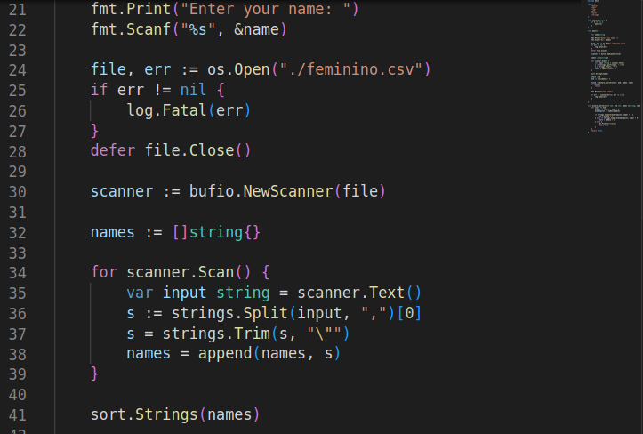

# Busca Binária 

## Problema

A busca binária é um método para achar itens em uma lista, de forma mais rápida que métodos _naive_ como a busca linear, que verifica item por item. 

## Estratégia

Como pré-condição, a lista precisa estar ordenada. Estando ordenada, a busca se inicia na metade da lista. Se o item buscado for maior que o primeiro termo (termo médio da lista), ele vai para o item médio da submetade da direita da lista original e analogamente vai para o item médio da submetade da esquerda da lista original. 

Essa busca, diminuindo metade da lista a cada etapa, é repetida, até achar o item ou acabar a lista. 

## Complexidade

Como a cada iteração/recursão a lista é diminuida pela metade, o numero de etapas é, na pior da hipóteses (ou seja, quando o item procurado é último item possível de ser buscado e a lista restante tem 1 elemento) 

1 = $\frac{n}{2^{etapas}} => 2^{etapas} = n => (aplicando \ log \ dos \ dois \ lados)\ logn = log2^{etapas} =>logn = etapas*log2=>etapas=logn$ 

Por tanto, o tempo de complexidade é $Olog(n)$

## Como o código funciona (exemplo em Golang)

Primeiro, é aberto o arquivo contendo os nomes a serem buscados e ele é ordenado, para cumprir a pré-condição de ordenação, descrita acima, com o método __Sort.strings__

Após isso, o programa busca com o método __binary_search__, que irá retornar um booleano para indicar sucesso, caso contrário irá jogar um erro. 

O método descrito acima funciona de forma bastante simples: enquanto o valor de entrada da busca binária (inicialmente 0) for menor que o valor de fim (inicialmente, o último índice da lista) ele vai para o meio da lista compreendida por esses dois valores. Com isso, compara usando o valor buscado com a metade da lista atual com  __strings.Compare__ se é maior, indo pra direita, se é menor, indo pra esquerda. Assim, busca no valor da metade dessas sublistas. Caso ache, retorne verdadeiro, caso acabe a iteração, retorna falso.

