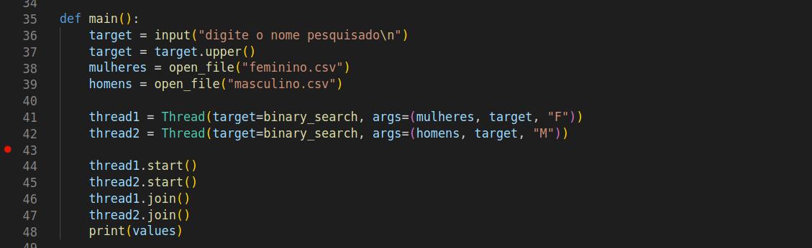

# Busca Binária Paralela

## Problema

A busca binária paralela é semelhante à busca binária tradicional, mas cada parte da lista em que o valor é buscado 
é distribuído a um processador. 

## Estratégia

Como pré-condição, a lista precisa estar ordenada. Estando ordenada, a lista é dividida em k segmentos, sendo k o número de threads inicilizadas, cada uma atribuída a um processador. Assim, dentro de cada thread, a busca se inicia na metade da lista atribuída. Se o item buscado for maior que o primeiro termo (termo médio da lista), ele vai para o item médio da submetade da direita da lista original e analogamente vai para o item médio da submetade da esquerda da lista original. 

Por fim, é necessário, por causa da sincronia, que cada thread seja finalizada antes de terminar o programa. 

## Complexidade

A complexidade da busca é semelhante à busca binária tradicional, mas cada $\frac{n}{k}$ (parte da lista atribuída a cada processador) é buscada de forma simultânea, ou seja, o tempo total é $O(log(\frac{n}{k}))$ 

## Como o código funciona (exemplo em Python)

O código se assemelha bastante ao código da busca binária simples, inclusive a forma que é a busca binária é implementada é igual. Portanto, será omitida. A diferença está no uso da API da biblioteca _threading_ do Python.

Cada thread é iniciada com o construtor __Thread__ e tem como _target_ uma função que será executada (nesse caso, busca binária) e em _args_ os argumentos para a função que será executada dentro daquela thread. Perceba, por tanto, que cada lista (masculina e feminina) será atribuída para threads diferentes, ou seja, serão buscadas ao mesmo em processadores diferentes. 

Por fim, é necessário, conforme dito acima, usar uma __thread.join__ (ou seja, a thread finalizar) pois, por exemplo, poderia ser printado os valores sem que a thread2 tivesse finalizado e isso indicaria um retorno errôneo  