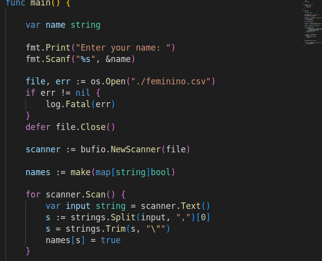
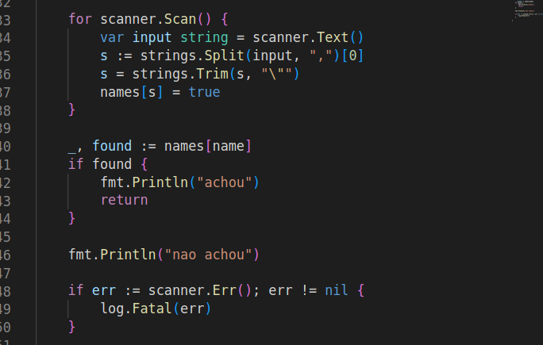

# Busca Indexada

## Problema

A busca indexada é um método para achar itens em uma coleção, de forma ainda mais rápida que a busca binária. Para isso, usa-se uma estrutura de dados do tipo Mapa. 

## Estratégia

Como pré-condição, a coleção é transformada em um HashMap, com pares de valores e chaves. Para isso, é preciso usar um valor possível de ser hasheado. Transformada a coleção, basta então, buscar pela chave que o HashMap retornará o valor associado ou indicará que o valor não foi possível de ser encontrado.  

## Complexidade

A complexidade da busca é apenas o _lookup_ de um HashMap, ou seja $O(log(n))$

## Como o código funciona (exemplo em Golang)

De forma bastante simples, o arquivo csv contem os nomes é aberto e a lista resultante é iterada dentro de um map com chave string e valor booleano. Cada nome presente na lista é uma chave no Map, com valor booleano _true_ 

Assim, o valor desejado é buscado no mapa (será a chave do lookup) e se encontrado, é retornado _true_ 

