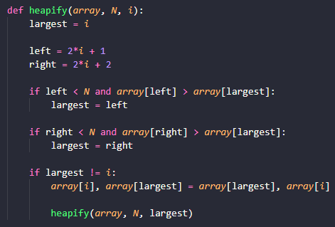
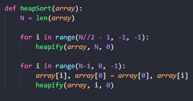

# Heapsort

## Problema

Heapsort é uma técnica de busca baseada em uma estrutura de dados de um heap binário, bastante semelhante ao Selection sort.

## Estratégia

Primeiro devemos tranformar o array em um heap, de forma com que fique ordenado através de uma árvore binária, na qual cada nível tem elementos maiores (ou menores) que os níveis subsequentes. 

## Complexidade

A complexidade do heapify é $O(log (n))$, porque no pior dos casos o maior elemento está no fundo do array e tem que ver subir todos níveis até o top, ou seja, $log_2(n)$  etapas. No heapsort, portanto, o tempo de execução é $O(n(log(n))$, pois a rotina heapify é chamada _n_ vezes

## Como o código funciona

Nessa parte do código, transformamos o array list em um heap, fazendo com que camada do heap sejam potencias de 2 (1, 2, 4, 8,...). Se existe a troca e é maior, a troca é feita. Se não for maior que a raiz, o número é pego. Por recursão, percorre todo array até obedecer a estrutura do heap

Após isso, jogamos a lista na função do heapsort. Ordena o array de forma com que ele sempre obedeça as condições de maxheap. Vai de um a um pegando o máximo e então heapifica o resto do array

