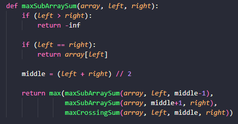
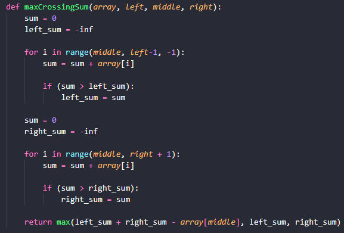

# Max subvetor

## Problema

Max Subvetor Sum é um problema que visa encontrar a maior soma contígua, ou seja, elementos seguidos, dentro de um array.

## Estratégia

Há várias técnicas utilizadas para encontrar a solução desse problema. A técnica utilizada aqui é a de __divisão e conquista__. Recursivamente, achamos a solução para a metade da esquerda e da direita do vetor dado (etapa de __divisão__), tendo como caso de base um array de elemento único. Além disso, calcula-se a solução para o subvetor que atravessa o pomnto do meio.

## Complexidade

O tempo de complexidade $O(log(n))$ pelo Método-Mestre https://www.enjoyalgorithms.com/blog/maximum-subarray-sum

## Como o código funciona

Nessa primeira etapa, separamos o vetor em três partes. Esquerda, meio e direita. Após isso, realizamos o método de divisão e conquista, onde retonarmos o máximo entre eles.

Após isso, encontramos o resultado para o subvetor que atravessa o ponto do meio, encontrando, a soma contígua. 
Isso é feito de forma iterativa, salvando uma variável para a soma da metade da direita (e esquerda) e encontrando qual a soma contígua máxima nesse setor. Por fim, combina-se a parte da direta e esquerda, descontando o valor do meio (pois está contido tanto na direita quanto na esquerda) e acha-se o máximo entre os três possíveis vetores.

