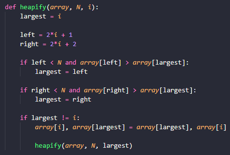
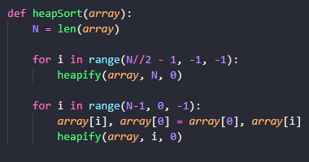

# Heapsort

## Problema

Heapsort é uma técnica de busca baseada em uma estrutura de dados de um heap binário, bem semelhante ao Selection sort.

## Estratégia

Primeiro devemos tranformar o array em um heap, de forma com que fique organizado. A idea é repetir o seguinte processo enquanto o valor de um filho for maior que o de seu pai.

## Complexidade

A complexidade do heapify é O(log n ) porque no pior dos casos sobe do fundo da raiz ate o fundo. Porém tempo de execucao vai chamando n vezes o heapify, portanto o tempo geral do Heapsort é O(n(logn))

## Como o código funciona

Nessa parte do código, transformamos o array list em um heap. Se existe a troca e é maior, a troca é feita. Se não for maior que a raiz, o número é pego.

Após isso, jogamos a lista na função do heapsort. Vai ordenando o array de forma com que ele sempre esteja em maxheap. Vai de um a um pegando o máximo e então heapifica o resto do array

