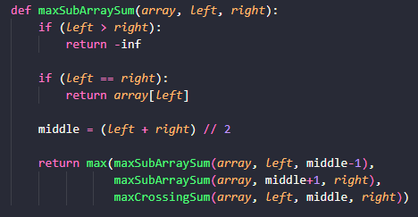
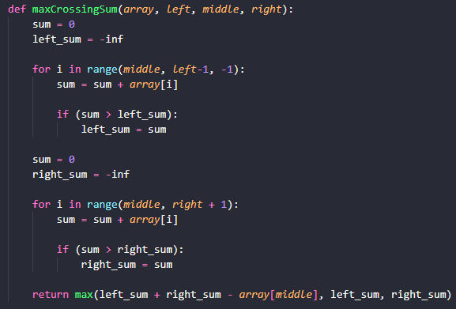

# Max subarray

## Problema

Max Subarray sum é uma técnica de estrutura de dados utilizada para achar a maior soma contígua dentro de um array.

## Estratégia

Para achar a maior soma contígua, devemos achar a sequência de números onde a soma só cresce, que nunca deixe de aumentar a soma para cada elemento que adicionamos. Muito cuidado, pois não é a maior soma total.

## Complexidade

O tempo de complexidade O(n(logn)) pelo metodo mestre https://www.enjoyalgorithms.com/blog/maximum-subarray-sum

## Como o código funciona

Nessa primeira etapa, separamos o array em três parte. Esquerda, meio e direita. Após isso, realizamos o método de divisão e conquista, onde retonarmos o máximo entre eles.

Após isso, aplicamos essa função, onde irá encontrar a soma contígua. Caso diminua é pelo motivo de não ser uma soma contígua, então é ignorado.

